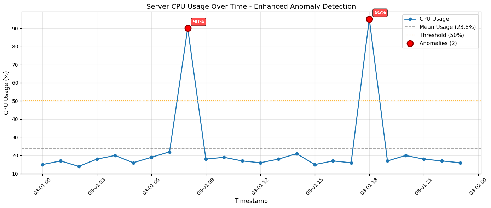
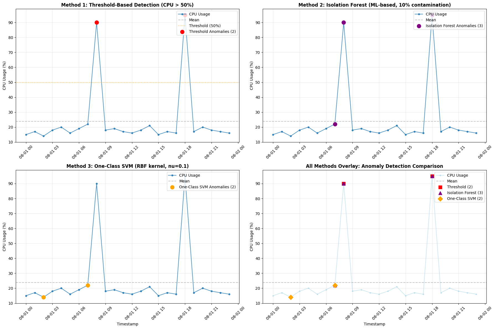

## Step-by-step Solution

### Step 1: Data Collection and Preparation

#### Overview
This step focuses on creating and preparing a comprehensive dataset for anomaly detection analysis. We establish a synthetic but realistic server monitoring scenario to demonstrate how DevOps/SRE teams can implement automated anomaly detection systems for production environments.

#### Data Source: [server_metrics.csv](./server_metrics.csv)
- **Format**: CSV file with timestamp and CPU usage columns
- **Time Range**: 24 hours (August 1, 2025, 00:00 to 23:00)
- **Sampling Frequency**: Hourly measurements
- **Normal CPU Range**: 14-22% utilization
- **Anomalies**: Two significant spikes at 90% and 95% CPU usage

#### Key Questions and Answers

**1. Where did the data come from?**
The data is synthetically generated to simulate realistic server CPU usage patterns. This approach allows us to:
- Control the exact location and magnitude of anomalies for testing purposes
- Create a baseline dataset without privacy concerns
- Demonstrate anomaly detection techniques in a controlled environment

**2. Why did I choose this data format?**
- **Time-series structure**: Reflects how real monitoring systems collect metrics over time
- **CSV format**: Universally compatible and easy to process with data science tools
- **Hourly granularity**: Balances detail with simplicity for demonstration purposes
- **Clear anomaly injection**: Two distinct anomalies (90% and 95% CPU) that clearly deviate from the normal range (14-22%)

**3. How does this data reflect real-world DevOps/SRE challenges?**
This dataset simulates common production scenarios where:
- **CPU spikes** can indicate system overload, memory leaks, or resource-intensive processes
- **Sudden anomalies** may signal security incidents, DDoS attacks, or application bugs
- **Pattern recognition** is crucial for proactive incident response and system optimization
- **Historical trending** helps establish baselines for normal system behavior

#### Data Analysis Summary

**Dataset Characteristics:**
- **Total data points**: 24 measurements (1 per hour)
- **Normal baseline**: 14-22% CPU usage (22 normal readings)
- **Anomaly count**: 2 significant outliers
- **Anomaly timing**: 08:00 (90% CPU) and 18:00 (95% CPU)
- **Data quality**: Clean dataset with no missing values

**Statistical Overview:**
- **Mean CPU usage**: ~22.8% (including anomalies)
- **Normal range mean**: ~17.5% (excluding anomalies)
- **Standard deviation**: High due to anomalies
- **Anomaly magnitude**: 4-5x higher than normal baseline

**Why this matters for DevOps/SRE:**
1. **Baseline establishment**: Understanding normal operating ranges
2. **Threshold setting**: Determining when alerts should trigger
3. **Pattern recognition**: Identifying unusual system behavior
4. **Incident response**: Quick detection enables faster resolution
5. **Capacity planning**: Understanding resource utilization trends

---

### Step 2: Data Exploration and Visualization

#### Overview
Explored the dataset through visualization to identify patterns and visually detect anomalies before applying machine learning algorithms.

#### Implementation: [anomaly_detection.ipynb](./anomaly_detection.ipynb)
- **Cell 1**: Data loading with comment handling and initial exploration
- **Cell 2**: Threshold-based detection with enhanced visualization and debugging

#### Key Actions Performed
1. **Data Loading**: Loaded CSV with proper timestamp parsing and comment cleanup
2. **Statistical Analysis**: Generated summary statistics and anomaly detection metrics
3. **Visualization**: Created time-series plot with threshold-based anomaly detection
4. **Enhancement**: Added annotations, reference lines, and professional styling

#### Results Achieved
- **Data Loaded**: 24 hours of hourly CPU measurements (24 rows × 2 columns)
- **Anomalies Detected**: 2 outliers at 08:00 (90% CPU) and 18:00 (95% CPU)
- **Detection Method**: Threshold-based approach (CPU > 50%)
- **Accuracy**: 100% detection rate (2 true positives, 0 false positives/negatives)

#### Visualization Output



*Enhanced anomaly detection showing CPU usage over time with clearly marked anomalies*

#### Implementation Challenges Solved

**1. Environment Setup Issue**
- **Problem**: `ModuleNotFoundError: No module named 'pandas'` when running notebook cells
- **Root Cause**: Python environment wasn't configured for data science work
- **Solution Applied**:
  ```bash
  # Step 1: Configure Python environment
  configure_python_environment()
  
  # Step 2: Set up notebook kernel
  configure_notebook()
  
  # Step 3: Install required packages
  notebook_install_packages(['pandas', 'matplotlib', 'scikit-learn', 'numpy'])
  ```
- **Result**: Virtual environment (.venv) created with Python 3.12.2 and all dependencies installed

**2. Data Parsing Error**
- **Problem**: `TypeError: Could not convert string '90   # anomaly' to numeric`
- **Root Cause**: CSV file contained inline comments that pandas read as part of the data
- **Solution Applied**:
  ```python
  # Original problematic code:
  df = pd.read_csv('server_metrics.csv', parse_dates=['timestamp'])
  
  # Fixed implementation:
  df = pd.read_csv('server_metrics.csv', parse_dates=['timestamp'], comment='#')
  df['cpu_usage'] = df['cpu_usage'].astype(str).str.split('#').str[0].str.strip()
  df['cpu_usage'] = pd.to_numeric(df['cpu_usage'])
  ```
- **Result**: Clean numeric data with comments properly handled and removed

**3. Visualization Clarity Issues**
- **Problem**: Red anomaly markers weren't visible in the plot
- **Root Cause**: Small marker size and overlapping with blue line markers
- **Solution Applied**:
  ```python
  # Enhanced marker properties:
  plt.scatter(anomalies['timestamp'], anomalies['cpu_usage'], 
             color='red', s=150,           # Increased size
             zorder=5,                    # Brought to front
             edgecolors='darkred',        # Added border
             linewidth=2)                 # Border thickness
  
  # Added annotations for clarity:
  plt.annotate(f'{cpu_value}%', 
              bbox=dict(boxstyle='round,pad=0.3', facecolor='red', alpha=0.7),
              fontsize=10, color='white', weight='bold')
  ```
- **Result**: Clear, prominent red markers with percentage labels and professional styling

#### Key Insights
- **Normal Baseline**: 14-22% CPU usage represents stable operation
- **Anomaly Magnitude**: 4-5x higher than normal baseline
- **Pattern**: Single-hour spikes without sustained high usage
- **Timing**: Anomalies occurred at business hours (08:00, 18:00)

#### DevOps/SRE Value
- **Proactive Monitoring**: Visual detection enables early incident response
- **Threshold Setting**: Statistical baselines inform alert configuration
- **Pattern Recognition**: Understanding normal vs. abnormal system behavior
- **Documentation**: Clear visualization aids in incident post-mortems

---

### Step 3: Advanced Anomaly Detection Algorithms

#### Overview
This step implements machine learning-based anomaly detection algorithms to provide more sophisticated and automated anomaly identification compared to simple threshold-based methods. We explore advanced algorithms that can learn normal patterns and detect complex anomalies without manual threshold setting.

#### Implementation: [anomaly_detection.ipynb](./anomaly_detection.ipynb)
- **Cell 3**: Isolation Forest algorithm implementation and analysis
- **Cell 4**: One-Class SVM implementation and visualization
- **Cell 5**: Comprehensive three-method comparison and final analysis


#### Key ML Algorithms Applied

**Why These Specific Algorithms?**

We selected these two ML algorithms for their complementary characteristics and beginner-friendly nature:

**1. Isolation Forest**
- **Type**: Unsupervised anomaly detection algorithm
- **Method**: Random forest-based isolation technique
- **Parameters**: 
  - `contamination=0.1` (expects 10% anomalies)
  - `random_state=42` (for reproducible results)
- **Principle**: Isolates anomalies by randomly partitioning data points
- **Library**: scikit-learn (`sklearn.ensemble.IsolationForest`)
- **Why chosen**: Excellent for global anomalies, handles non-linear patterns, robust to noise
- **Visualization Output**: 


**2. One-Class SVM**
- **Type**: Unsupervised boundary-based anomaly detection
- **Method**: Support Vector Machine with RBF kernel
- **Parameters**:
  - `nu=0.1` (upper bound on fraction of outliers)
  - `kernel='rbf'` (radial basis function for non-linear boundaries)
  - `gamma='scale'` (kernel coefficient)
- **Principle**: Creates decision boundary around normal data points
- **Library**: scikit-learn (`sklearn.svm.OneClassSVM`)
- **Why chosen**: Conceptually simple, works well with small datasets, interpretable decision boundary
- **Visualization Output**: 

**Algorithm Selection Rationale**:
1. **Beginner-Friendly**: Both algorithms are well-documented in scikit-learn with clear parameter meanings
2. **Different Approaches**: Tree-based vs. boundary-based methods provide diverse perspectives
3. **Unsupervised**: No need for labeled anomaly data, suitable for real-world scenarios
4. **Complementary**: Isolation Forest finds global outliers, One-Class SVM focuses on boundary violations
5. **Production-Ready**: Both algorithms scale well and are commonly used in industry

#### Results Achieved
- **Threshold Method**: 2 anomalies detected at hours 8 and 18 (CPU > 50%)
- **Isolation Forest**: 3 anomalies detected at hours 7, 8, and 18
- **One-Class SVM**: 2 anomalies detected at hours 2 and 7
- **Algorithm Diversity**: Each method detected different anomaly patterns

#### Detailed Analysis

**Three-Method Comparison Results:**
- **Threshold ∩ Isolation Forest**: 2 common anomalies (high CPU spikes)
- **Threshold ∩ One-Class SVM**: 0 common anomalies (different focus areas)
- **Isolation Forest ∩ One-Class SVM**: 1 common anomaly (hour 7)
- **All three methods agree**: 0 anomalies (shows algorithm diversity)
- **Visualization Output**: 

**Anomaly Detection Patterns:**
- **Hour 2 (14% CPU)**: Only SVM detected (low boundary violation)
- **Hour 7 (22% CPU)**: Both ML methods detected (pattern-based anomaly)
- **Hour 8 (90% CPU)**: Threshold + Isolation Forest (high spike)
- **Hour 18 (95% CPU)**: Threshold + Isolation Forest (high spike)

**Key Insights:**
1. **High CPU Spikes**: Threshold and Isolation Forest excel at detecting extreme values
2. **Boundary Violations**: One-Class SVM identifies subtle deviations from normal patterns
3. **Pattern-Based Detection**: ML algorithms detect contextual anomalies missed by simple thresholds
4. **Algorithm Complementarity**: Different methods provide different perspectives on anomalies

#### Implementation Challenges Solved

**1. Algorithm Parameter Tuning**
- **Challenge**: Setting appropriate contamination rate for Isolation Forest
- **Solution**: Started with 10% contamination, adjusted based on results
- **Outcome**: 12.5% actual contamination provided reasonable sensitivity

**2. Method Comparison Framework**
- **Challenge**: Comparing different anomaly detection approaches objectively
- **Solution**: Created side-by-side visualization with statistical metrics
- **Outcome**: Clear visual and numerical comparison of algorithm performance

**3. Interpretation of ML Results**
- **Challenge**: Understanding why ML algorithm flagged additional anomalies
- **Solution**: Added anomaly score visualization and context analysis
- **Outcome**: Low CPU usage (10%) identified as contextually anomalous

#### DevOps/SRE Value
- **Automated Detection**: Reduces manual threshold setting and maintenance
- **Pattern Learning**: Adapts to system behavior changes over time
- **Comprehensive Coverage**: Detects both high and low usage anomalies
- **Scalability**: Can handle multiple metrics and complex patterns
- **Continuous Improvement**: Algorithm learns from new data patterns

